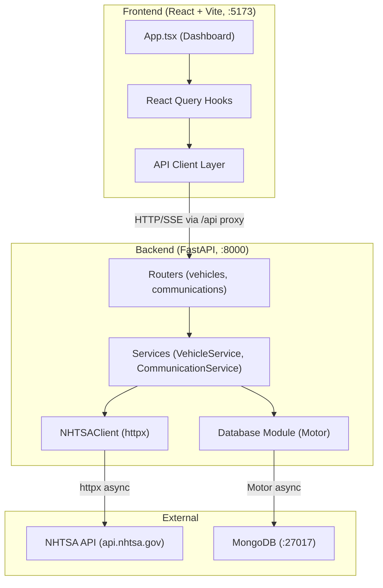

# Architecture

**Analysis Date:** 2026-03-27

## Pattern Overview

**Overall:** Full-stack monorepo with separate Python backend (FastAPI) and React frontend (Vite/TypeScript). Classic client-server architecture with REST API + SSE streaming.

**Key Characteristics:**
- Feature-based module organization on both backend and frontend
- Service layer pattern on the backend (static methods on service classes)
- MongoDB as the sole data store (async via Motor driver)
- Server-Sent Events (SSE) for real-time fetch progress
- Vite dev server proxies `/api` to FastAPI backend at `:8000`
- camelCase JSON serialization via Pydantic alias generators (snake_case internally, camelCase over the wire)

## Component Diagram

## Layers

**Frontend - UI Layer:**
- Purpose: Single-page dashboard for tracking vehicles and viewing communications
- Location: `frontend/src/`
- Contains: React components, hooks, API client
- Depends on: Backend REST API
- Used by: End users via browser

**Frontend - API Client Layer:**
- Purpose: Typed HTTP client wrapping `fetch()` calls to backend
- Location: `frontend/src/client/`
- Contains: `api.ts` (base HTTP), `vehicles.ts`, `communications.ts`, `types.ts`
- Depends on: Browser Fetch API
- Used by: React Query hooks

**Frontend - Hooks Layer:**
- Purpose: React Query wrappers for data fetching, mutations, cache invalidation
- Location: `frontend/src/features/*/hooks/`
- Contains: `useVehicles.ts`, `useCommunications.ts`, `useDiscovery.ts`
- Depends on: API client layer, TanStack React Query
- Used by: UI components

**Backend - Router Layer:**
- Purpose: HTTP endpoint definitions with request validation
- Location: `backend/src/vehicles/router.py`, `backend/src/communications/router.py`
- Contains: FastAPI route handlers, query parameter definitions
- Depends on: Service layer, Pydantic schemas
- Used by: FastAPI app (`backend/src/main.py`)

**Backend - Service Layer:**
- Purpose: Business logic, NHTSA data processing, MongoDB operations
- Location: `backend/src/vehicles/service.py`, `backend/src/communications/service.py`
- Contains: `VehicleService`, `CommunicationService` (static method classes)
- Depends on: Database module, NHTSAClient, schemas
- Used by: Router layer

**Backend - External API Client:**
- Purpose: Async HTTP client for NHTSA government API
- Location: `backend/src/communications/nhtsa_client.py`
- Contains: `NHTSAClient` class, response extraction helpers
- Depends on: httpx, config settings
- Used by: CommunicationService

**Backend - Data Layer:**
- Purpose: MongoDB connection management via Motor (async driver)
- Location: `backend/src/database.py`
- Contains: Singleton `Database` class, connection lifecycle, index creation
- Depends on: Motor, config settings
- Used by: All service classes via `get_database()`

## Data Flow

**Vehicle Discovery & Addition:**

1. User selects year/make/model via cascading dropdowns in `AddVehicleModal`
2. Frontend calls discovery endpoints: `/api/communications/discovery/{years,makes,models,variants}`
3. Backend's `CommunicationService` delegates to `NHTSAClient` for make/model/variant lookups
4. User selects a specific vehicle variant (which has the correct `vehicleId`)
5. Frontend POSTs to `/api/vehicles` with `vehicleId`, year, model
6. Backend upserts vehicle document into MongoDB `vehicles` collection

**Communication Fetch (SSE Flow):**

1. User clicks "Fetch" on a vehicle card
2. Frontend POSTs to `/api/communications/fetch` via `communicationApi.fetchWithProgress()`
3. Backend returns SSE stream (`StreamingResponse` with `text/event-stream`)
4. `CommunicationService.fetch_and_store()` is an async generator yielding progress dicts:
   - Fetches vehicle details from NHTSA (`/vehicles/{id}/details`) to get comm IDs
   - Checks MongoDB for already-cached comm IDs (skip if not `force_refresh`)
   - Fetches missing comms via `NHTSAClient.fetch_communications_batch()` (semaphore-limited concurrency of 3)
   - Upserts each communication into MongoDB `communications` collection
   - Yields progress updates at each step
5. Frontend reads SSE stream, updates progress bar via `useFetchCommunications` hook
6. On completion, React Query invalidates communication and vehicle list caches

**Communication Listing:**

1. Frontend queries `/api/communications?vehicle_id=X&search=...&comm_type=...`
2. Backend builds MongoDB query with filters (regex search, type filtering, pagination)
3. Returns paginated `CommunicationListResponse` with camelCase JSON

**State Management:**
- TanStack React Query handles all server state (caching, invalidation, refetching)
- Query key factory pattern in `frontend/src/features/queryKeys.ts` prevents cache bugs
- Local UI state (selected vehicle, search term, type filters) via `useState` in `App.tsx`
- No global state library (no Redux, Zustand, etc.)

## Key Abstractions

**CamelModel (Base Schema):**
- Purpose: Pydantic BaseModel that auto-converts snake_case to camelCase for JSON serialization
- Location: `backend/src/vehicles/schemas.py`
- Pattern: All API response/request schemas inherit from `CamelModel`
- Used by: `backend/src/communications/schemas.py`, `backend/src/vehicles/schemas.py`

**Communication Type Detection:**
- Purpose: Multi-strategy classifier for NHTSA communication types (TSB, PIT, PIC, etc.)
- Location: `backend/src/communications/schemas.py` (`get_comm_type()`)
- Pattern: Priority chain: prefix-based > summary text > document type > NA format > OTHER
- Used by: `CommunicationService.fetch_and_store()`, `migrations.py`

**Query Key Factory:**
- Purpose: Structured cache key generation for React Query
- Location: `frontend/src/features/queryKeys.ts`
- Pattern: `vehicleKeys.list(page, perPage)` returns `['vehicles', 'list', { page, perPage }]`
- Used by: All hooks for queries and cache invalidation

## Entry Points

**Backend:**
- Location: `backend/src/main.py`
- Triggers: `uvicorn src.main:app` from the `backend/` directory
- Responsibilities: Creates FastAPI app, configures CORS, mounts vehicle + communication routers, manages MongoDB lifecycle

**Frontend:**
- Location: `frontend/src/main.tsx`
- Triggers: `npm run dev` (Vite dev server)
- Responsibilities: Renders `<App />` into DOM root

**Scripts:**
- Location: `backend/src/scripts/seed_vehicle_catalog.py`
- Triggers: Manual execution for pre-populating vehicle catalog data
- Responsibilities: Fetches model data from NHTSA via curl, seeds MongoDB

**Migration:**
- Location: `backend/src/migrations.py`
- Triggers: Manual `python -m src.migrations`
- Responsibilities: Backfills `communication_type` field using enhanced detection logic

## Error Handling

**Strategy:** Fail-fast with HTTP error responses. No global error boundary on frontend.

**Backend Patterns:**
- Router layer raises `HTTPException` for 404/400/500 cases
- `NHTSAClient` uses retry with exponential backoff for 403 (rate limiting) and request errors
- `fetch_and_store()` yields error status dicts instead of raising (SSE-compatible)
- Semaphore + 200ms delay between requests to avoid NHTSA rate limiting

**Frontend Patterns:**
- `ApiError` class in `frontend/src/client/api.ts` wraps non-OK HTTP responses
- React Query `retry: 1` for automatic single retry on failed queries
- SSE fetch has `AbortController` support for cancellation
- `useFetchCommunications` hook tracks error state separately

## Cross-Cutting Concerns

**Logging:** `print()` statements only (no structured logging framework). Used in `database.py` for connection lifecycle and `migrations.py` for progress.

**Validation:** Pydantic v2 schemas handle all request/response validation on the backend. Frontend TypeScript interfaces mirror backend schemas.

**Authentication:** None. No auth layer exists. API is open.

**CORS:** Configured in `backend/src/main.py` via FastAPI middleware. Allows `localhost:5173` and `127.0.0.1:5173` by default.

## MongoDB Collections

| Collection | Purpose | Key Indexes |
|------------|---------|-------------|
| `vehicles` | Tracked vehicles with config | `vehicle_id` (unique) |
| `communications` | Cached NHTSA communications | `nhtsa_id` (unique), `vehicle_id`, `communication_date` |
| `searches` | Search history | `created_at` |

---

*Architecture analysis: 2026-03-27*
