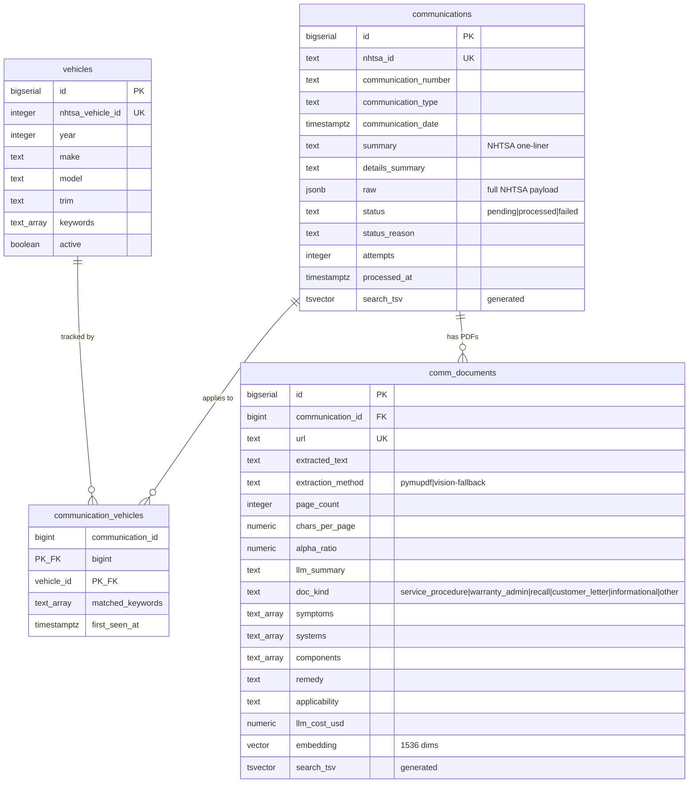
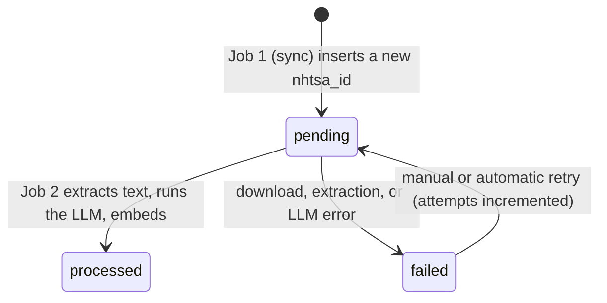

# Canonical Schema (Phase A)

The Phase A store fixes the central flaw in the Mongo design: today a
communication is upserted once per `(nhtsa_id, vehicle_id)` pair, so a bulletin
that applies to three tracked vehicles is stored three times and would be
extracted, summarised, and embedded three times. Here a communication exists
exactly once, keyed by `nhtsa_id`, and vehicles attach through a join table.

## ER diagram



## The job contract

`communications.status` is the only coupling between the two jobs.



Job 1 never touches documents; Job 2 never talks to the NHTSA discovery API.
Either can be re-run independently without coordinating with the other.

## Design decisions

### Migration tooling: plain ordered SQL

Files live in `backend/migrations/NNNN_name.sql` and run in filename order via
`python -m src.db.migrate`. Applied versions are recorded in
`schema_migrations` with a checksum, so re-running is a no-op and editing an
already-applied migration is refused rather than silently ignored (which would
leave the file and the live database quietly out of sync).

Alembic was considered and rejected: it earns its complexity by autogenerating
diffs from ORM models, and there are no ORM models here. A solo project with a
linear schema history does not need the extra layer.

### Driver: asyncpg, no ORM

The pipeline and read API are hand-written SQL against Postgres-specific types
(`vector`, `tsvector`, `text[]`) that an ORM abstracts poorly. asyncpg is the
fastest driver and is what SQLAlchemy's async mode would sit on anyway.

### Embedding dimension: 1536, not 3072

`gemini-embedding-001` emits 3072 dimensions by default, but pgvector refuses to
build an `hnsw` or `ivfflat` index above **2000** dimensions:

```
ERROR:  column cannot have more than 2000 dimensions for hnsw index
```

The model supports Matryoshka (MRL) truncation, so requesting
`output_dimensionality=1536` yields a usable vector that indexes directly. The
alternative, storing `vector(3072)` and indexing a `halfvec` cast, adds a lossy
second representation for no benefit at this corpus size.

### Search vectors are generated columns, not triggers

`to_tsvector()` is IMMUTABLE, but `array_to_string()` and `concat_ws()` are only
STABLE, so neither can appear in a `GENERATED` expression. Rather than fall back
to a trigger, the schema defines a thin IMMUTABLE wrapper:

```sql
CREATE FUNCTION immutable_array_to_string(arr text[], sep text)
RETURNS text LANGUAGE sql IMMUTABLE PARALLEL SAFE AS
$$ SELECT array_to_string(arr, sep) $$;
```

This is safe because `text[]` output is fully deterministic, and it keeps the
search vector as a generated column, which cannot drift from its source rows the
way a trigger can if someone forgets to fire it.

Two separate vectors exist because a generated column may only reference its own
row: `communications.search_tsv` covers the NHTSA summary and bulletin number,
`comm_documents.search_tsv` covers the LLM fields and the extracted text. The
read API searches across both through the FK join.

### Tags: arrays plus GIN, not a tag table

`symptoms`, `systems`, and `components` are `text[]` with GIN indexes, giving
containment queries (`symptoms @> ARRAY['no start']`) without a join. A
normalised tag table would be the right call once tags need their own metadata
or user curation; that is a Phase B/C concern, not a Phase A one.

## Deliberately deferred to Phase C

The following are **not** in this schema, by design:

* **Users and authentication.** No `users` table, no ownership column anywhere.
  Phase A is single-tenant: the corpus is Marcus's, implicitly.
* **Per-user vehicle subscriptions.** `vehicles.active` is a personal on/off
  switch, not a subscription. Phase C introduces `users` and a
  `user_vehicles` (or equivalent) table, at which point `vehicles` becomes a
  shared catalog rather than a personal list.
* **Lazy ingest / per-user fan-out.** Phase A syncs every tracked vehicle
  eagerly. Phase C's lazy ingest needs request-time bookkeeping this schema does
  not model.
* **Alert delivery state.** The Phase A digest tracks a single watermark. Phase C
  needs per-user, per-channel delivery records for alerts and digests.

The join table is what makes that migration cheap: adding users means adding a
table beside `communication_vehicles`, not reshaping `communications`.

## Applying migrations

```bash
cd backend
python -m src.db.migrate            # apply pending
python -m src.db.migrate --status   # show applied / pending
```

Requires `DATABASE_URL` in `backend/.env` (see [database.md](database.md)).
